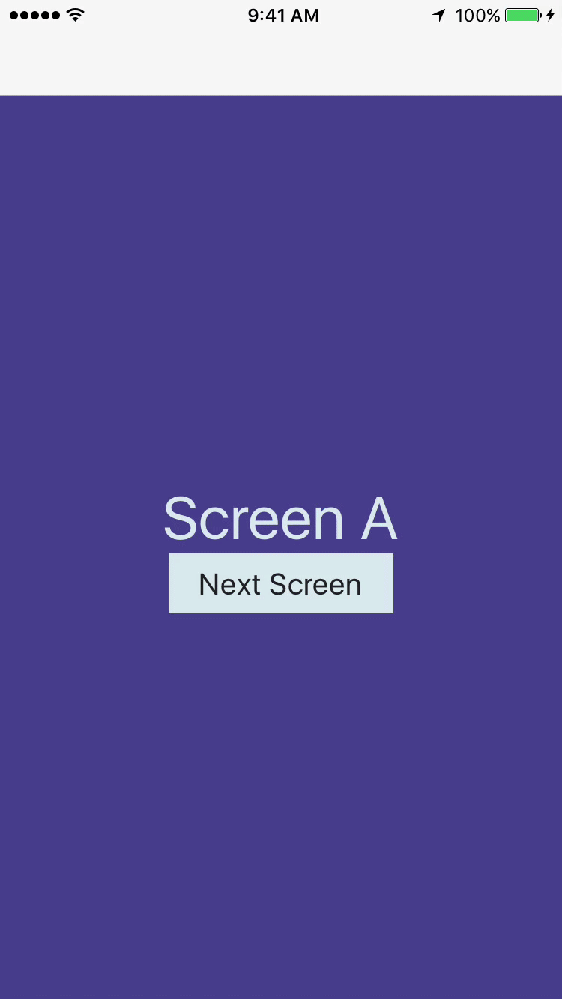
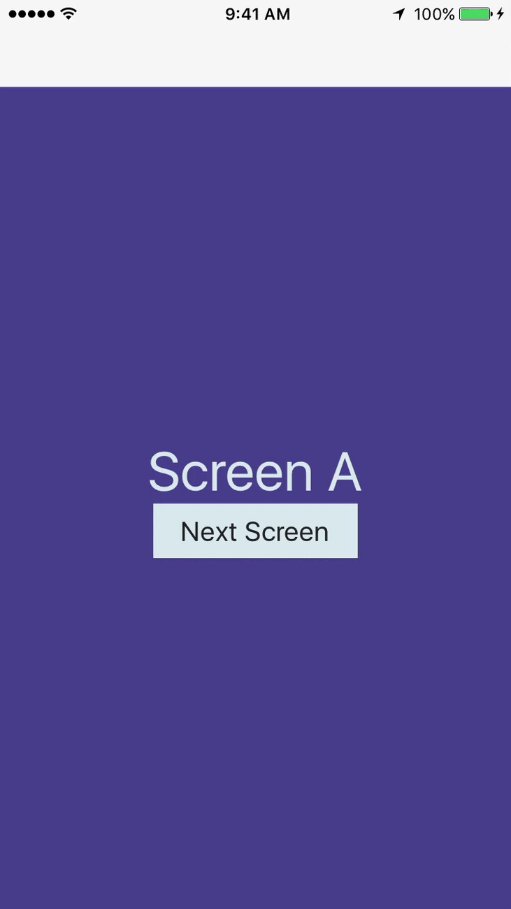
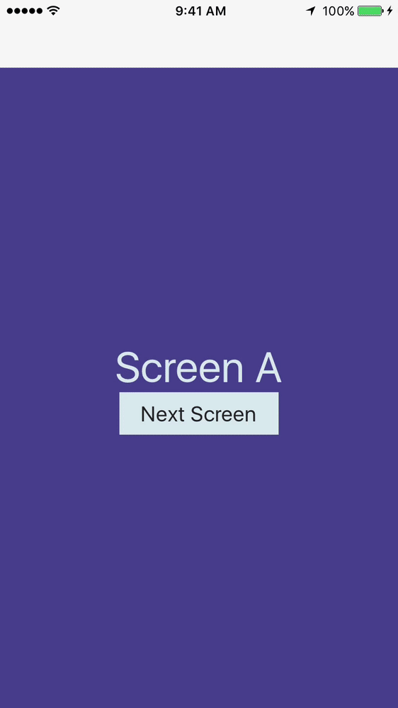
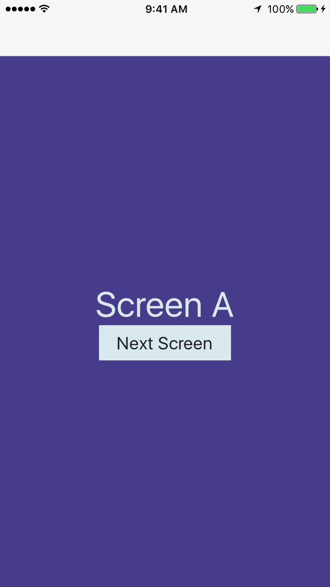
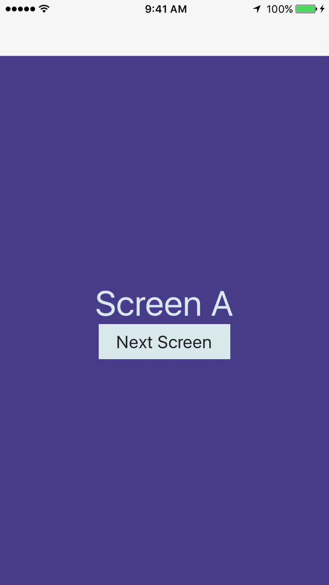

# react-navigation-transitions

### Installation
`npm install react-navigation-transitions --save`

### Instructions
These functions are meant to be used as the `transitionConfig` with [react-navigation](https://reactnavigation.org/). So far it includes the following transitions:

`fromLeft`

`fromTop`

`fromRight`

`fromBottom`

`fadeIn`

`fadeout`

`zoomIn`

`zoomOut`

`flipY`

`flipX`

More will be added in future versions.

### Example

```javascript
import { createStackNavigator } from 'react-navigation';
import { fromLeft } from 'react-navigation-transitions';

const appStack = createStackNavigator(
  {
    ScreenA: {
      screen: ScreenA,
    },
    ScreenB: {
      screen: ScreenB,
    },
  },
  {
    initialRouteName: 'ScreenA',
    transitionConfig: () => fromLeft(),
  },
);
```

The default duration is 300 milliseconds but you can pass is a custom transition duration like so:

```javascript
transitionConfig: () => fromLeft(1000),
```

## Adding transitions to specific screens

In the example above, the same transition animation will be used for all screens within the
navigator. The example below shows how to use different transitions for specific screens.

Thank you to [SebLambla](https://github.com/SebLambla) for coming up with this great example.

```javascript
import { fromLeft, zoomIn, zoomOut } from 'react-navigation-transitions'

const handleCustomTransition = ({ scenes }) => {
  const prevScene = scenes[scenes.length - 2];
  const nextScene = scenes[scenes.length - 1];

  // Custom transitions go there
  if (prevScene
    && prevScene.route.routeName === 'ScreenA'
    && nextScene.route.routeName === 'ScreenB') {
    return zoomIn();
  } else if (prevScene
    && prevScene.route.routeName === 'ScreenB'
    && nextScene.route.routeName === 'ScreenC') {
    return zoomOut();
  }
  return fromLeft();
}

const PrimaryNav = createStackNavigator({
  ScreenA: { screen: ScreenA },
  ScreenB: { screen: ScreenB },
  ScreenC: { screen: ScreenC },
}, {
  transitionConfig: (nav) => handleCustomTransition(nav)
})
```

## Use with SafeAreaView

If you are having trouble with `SafeAreaView` like in this [issue](https://github.com/plmok61/react-navigation-transitions/issues/11), try adding `forceInset={{ top: 'always', bottom: 'always' }}`

## GIFS

### fromLeft



### fromTop


### fadeIn



### zoomIn


### zoomOut



### flipY



### flipX



The basis for these functions can be found in the `react-navigation` docs [here](https://reactnavigation.org/docs/stack-navigator.html#modal-stacknavigator-with-custom-screen-transitions).
